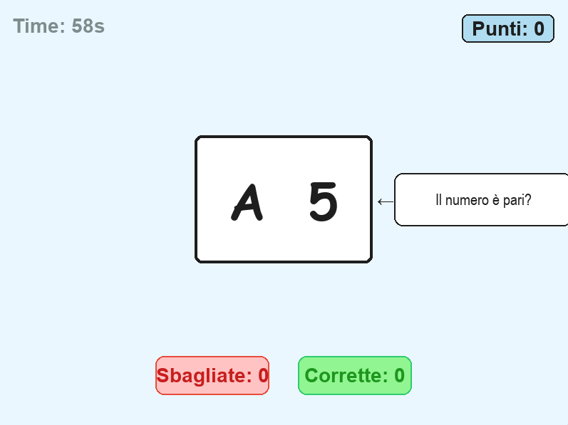
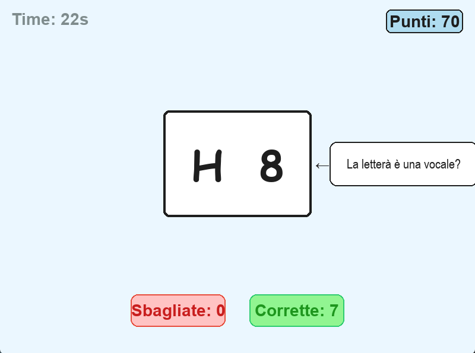

# Brain Shift — progetto di gruppo

## Chi siamo

- Simone Piccolo 1 — simone.piccolo@jcmaxwell.it /Simone-Piccolo
- Andrea De Vivo 2 — andrea.devivo@jcmaxwell.it / AndreaDevivo

Classe 4A Informatica — a.s. 2025-26.

## Cos'è Brain Shift
Brain Shift è un gioco di velocità che dura 60 secondi.Il funzionamento è molto semplice: al centro dello schermo compare una carta che contiene una lettera e un numero. La regola da seguire non è sempre la stessa, ma cambia dinamicamente round per round: viene indicata da un riquadro con una freccia che spunta sulla destra della carta.

Il giocatore deve seguire una regola diversa in base a dove compare la carta sullo schermo:
- Se il riquadro mostra la domanda **TOP ("Il numero è pari?")**: dobbiamo controllare il numero sulla carta e capire se è pari o dispari.
- Se il riquadro mostra la domanda **BOTTOM ("La lettera è una vocale?")**: dobbiamo controllare la lettera e vedere se è una vocale o una consonante.
- Le risposte utilizzabili sono **SI** o **NO**
## Come giocare

Istruzioni minime ma complete per far partire il gioco da clone pulito:

```bash
git clone <https://github.com/AndreaDevivo/Progetto-Informatica-De-Vivo---Piccolo->
cd brain_shift 
pip install -r requirements.txt
python main.py
```

Specificate:

- versione Python richiesta: 3.11
- versione pygame richiesta: 2.0
- versione Pytest richiesta: 9.0.3

## Controlli

- ← freccia sinistra: per rispondere NO
- → freccia destra: per rispondere SI

## Screenshot



## Struttura del repository 

Breve spiegazione di dove sta cosa:

```
brain_shift/
├── main.py           ← entry point
├── ui.py             ← interfaccia grafica
├── rules.py          ← logica regole
├── scoring.py        ← sistema scoring
├── models.py         ← contenitore di classi
├── generator.py      ← generatore di oggetti
├── config.py         ← configurazione per interfaccia
├── docs/             ← documentazione
├── docs/img          ← screenshot del gioco
└── tests/            ← test pytest


```
### Come Lanciare i test
```bash
pytest tests/
---
```
