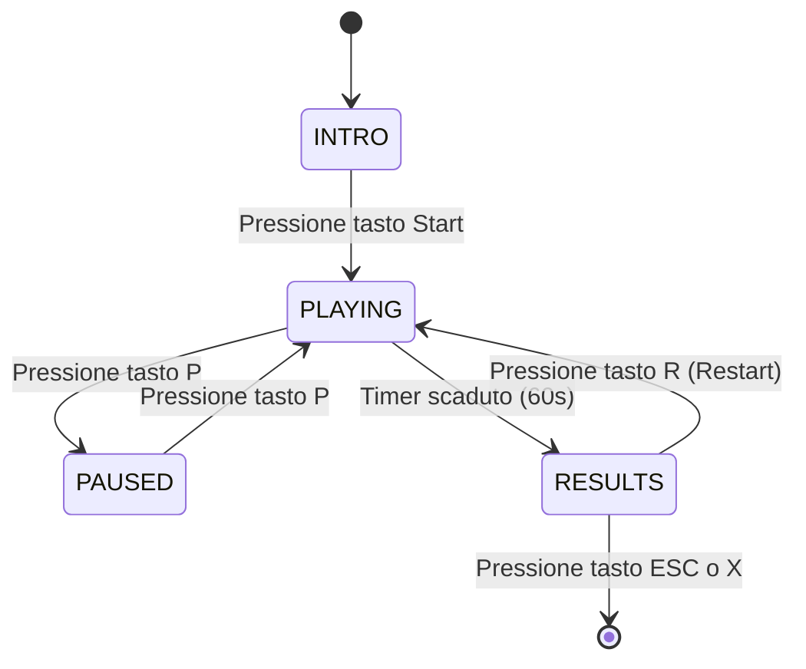
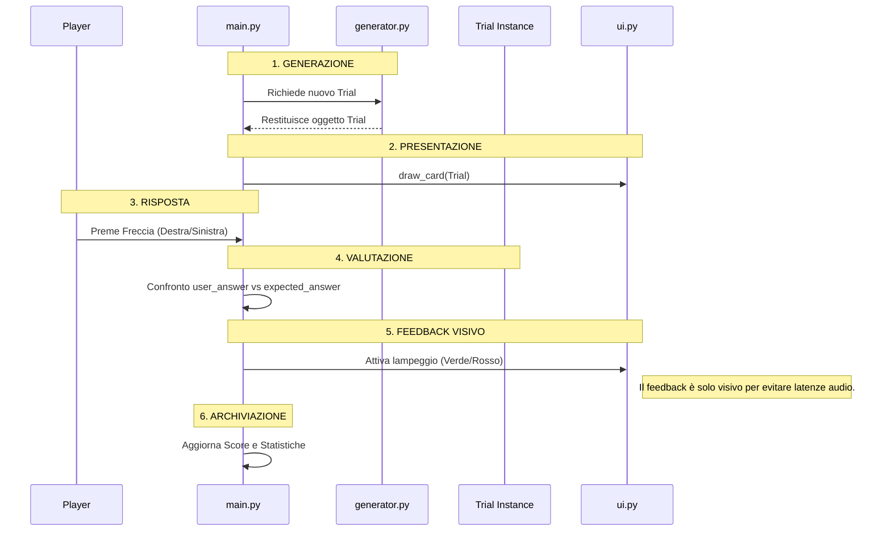

# Architettura

# Come Abbiamo Organizzato il progetto

Per questo progetto abbiamo deciso di non mettere tutto in un unico file, ma di dividere il lavoro in diversi "pezzi" (moduli). Questo ci è servito per due motivi: primo, per tenere il codice ordinato e capire subito dove andare a colpo d'occhio se c'era un bug; secondo, per permettere a pytest di testare la logica senza far crashare tutto perché Pygame cercava di aprire una finestra.

## Decomposizione in moduli

Per ciascun modulo del vostro progetto, una-due righe:

- `main.py` — È il "cervello": qui c'è il loop che tiene in vita il gioco, controlla i tasti premuti e decide quando il tempo è scaduto.

- `config.py`— Qui abbiamo messo tutte le costanti come i colori (VERDE, ROSSO), la durata della partita (60s) e le dimensioni della finestra. Se vogliamo cambiare il colore dello sfondo.

- `models.py` — Contiene la dataclass Trial. È solo un contenitore che tiene insieme i dati di ogni carta (lettera, numero, posizione e risposta corretta).

- `rules.py` — La logica pura. Qui ci sono le funzioni che dicono se un numero è pari o una lettera è una vocale.È il file che viene testato con i test del prof

- `scoring.py` — Una funzione semplice che aggiunge 10 punti se la risposta è giusta o 0 punti se la risposta è sbagliata.

- `generator.py` — Serve a creare le carte. Usa un sistema a "seed" (il seme del numero casuale) così se si gioca con lo stesso seed, le carte escono nello stesso ordine.

- `ui.py` — Qui c'è tutto quello che si vede: come disegnare la carta (sopra o sotto), il timer e il punteggio.

Se avete aggiunto/rimosso moduli rispetto alla struttura suggerita, spiegate perché.

## Separazione logica / presentazione
Abbiamo diviso il codice in due "mondi" separati:

Moduli "Puri" (Logica): rules.py, scoring.py, generator.py e models.py. Questi file non sanno cosa sia Pygame. Contengono solo matematica, stringhe e logica booleana. Questo ci permette di lanciare i test di pytest istantaneamente.

Moduli di Rendering: ui.py e main.py. Solo loro importano Pygame e si occupano di finestre, colori e tastiera.

Come comunicano? Il main.py fa da ponte: prende i dati dai moduli puri (es. un nuovo Trial dal generatore) e li passa alle funzioni di ui.py per disegnarli. Abbiamo scelto di passare i dati come parametri delle funzioni invece di usare variabili globali per evitare che il codice diventasse un "groviglio" difficile da seguire.

## Macchina a stati

Diagramma della macchina a stati (Mermaid va benissimo, è supportato da GitHub):

Spiegazione degli stati

INTRO (L'inizio): È la prima cosa che vedi. Il gioco è fermo e aspetta noi. Disegna il titolo e una scritta tipo "Premi un tasto per iniziare". Serve a non far partire il timer finché il giocatore non è pronto e concentrato.

PLAYING: È lo stato dove succede tutto. Il timer scende, compaiono le carte e il punteggio sale. Qui il computer ascolta solo le frecce per rispondere. Se premiamo P, decidiamo di fermare un attimo tutto.

PAUSED (Pausa): Abbiamo aggiunto questo stato perché se qualcuno ti chiama mentre giochi, non vuoi perdere i punti. Il timer si blocca e appare una scritta "PAUSA" sopra il gioco. Finché non ripremi P, non puoi dare risposte.

RESULTS (Com'è andata?): Quando il timer arriva a zero, finiamo qui. Il gioco ci fa vedere il totale dei punti e quante ne abbiamo indovinate o sbagliate. Da qui abbiamo due strade: o premiamo R per resettare tutto e rifare una partita, oppure premiamo ESC se siamo stanchi e vogliamo chiudere il programma.

Perché abbiamo fatto così?

Abbiamo usato una variabile chiamata state nel ciclo principale. È stato molto utile perché così non dovevamo scrivere mille if complicati: se state == "PAUSED", il programma sa che deve solo disegnare la scritta di pausa e ignorare le frecce direzionali. È un sistema che rende tutto più fluido.

## Flusso di un trial

## Dati principali

Per gestire le informazioni senza perderci tra mille variabili, abbiamo usato le dataclass. Sono comode perché raggruppano i dati in modo ordinato:

Trial (in models.py):

Cosa contiene: Posizione (TOP/BOTTOM), lettera, numero e la risposta corretta calcolata.

Chi lo crea: Il generator.py.

Chi lo modifica: Il main.py quando riceve l'input dell'utente per segnare se la risposta data è giusta o sbagliata.

ScoringState (Logica di Sessione):

Cosa contiene: Il punteggio attuale (score), il numero di risposte corrette consecutive (per eventuali bonus) e il totale delle risposte date.

Chi lo crea: Viene inizializzato nel main.py all'inizio di ogni partita.

Chi lo modifica: Il modulo scoring.py tramite la funzione apply_answer. In pratica, il main passa lo stato attuale a scoring.py, che gli restituisce lo stato aggiornato.

SessionStats (Statistiche Finali):

Cosa contiene: I dati per la schermata finale: totale corrette, totale errate e la precisione (accuratezza %).

Chi lo crea: Il main.py a fine partita.

Chi lo modifica: Nessuno, serve solo per la lettura nella schermata RESULTS.

## Scoring: come è implementato

La logica del punteggio è nel file scoring.py. Abbiamo tradotto la specifica in modo molto lineare: ogni volta che indovini, chiamiamo la funzione apply_answer che aggiunge 10 punti. Non abbiamo messo moltiplicatori per ora e abbiamo deciso di non inserire feedback sonori per evitare problemi di latenza o dipendenze da driver audio esterni, preferendo un feedback visivo immediato tramite il cambio di colore della carta, così i test di pytest sono più facili da gestire e il punteggio è sempre prevedibile. Se sbagli, il punteggio rimane fermo e passiamo alla carta successiva.

## Generatore: bilanciamento e seed

Il generator.py è quello che "pesca" le carte dal mazzo:

Evitare streak lunghe: Per non far uscire sempre la stessa cosa, peschiamo da liste di lettere e numeri già bilanciate che abbiamo messo nel config.py.

Bilanciamento SÌ/NO: Abbiamo calibrato le liste in modo che ci sia circa il 50% di probabilità che la carta rispetti la regola (Pari o Vocale). Così il gioco non è troppo facile né troppo difficile , una via di mezzo.

Il Seed: Questa è la parte più tecnica. Usiamo random.Random(seed) nel main. Perché così, se usiamo lo stesso numero (es. 42), le carte escono sempre nello stesso ordine. Questo ci serve per i test automatici: sappiamo già cosa deve uscire e possiamo verificare se il programma risponde bene.

## Fading istruzioni

Qui abbiamo usato un trucco per pulire lo schermo quando il giocatore impara a giocare:

La variabile: Usiamo correct_answers dentro lo ScoringState. Ogni volta che il main vede una risposta giusta, aumenta questo contatore.

Come funziona il fading: Non è un timer. Nel loop di disegno, controlliamo se correct_answers è minore di 10.

Tecnicamente: Se sei sotto le 10 risposte giuste, passiamo alla UI un valore di Alpha (opacità) di 255 (pieno). Appena arrivi a 10, l'Alpha diventa 0. Questo passaggio è puramente visivo e serve a premiare l'apprendimento del giocatore pulendo l'interfaccia di gioco."

---
